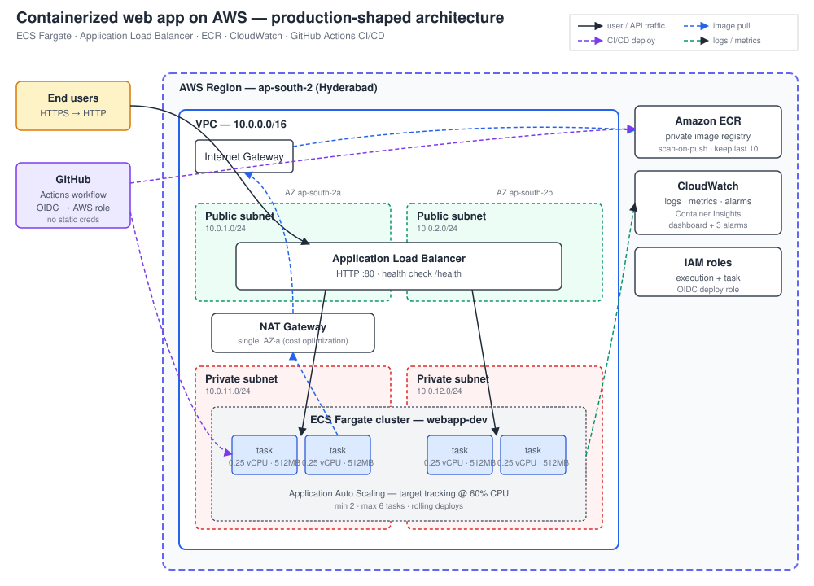
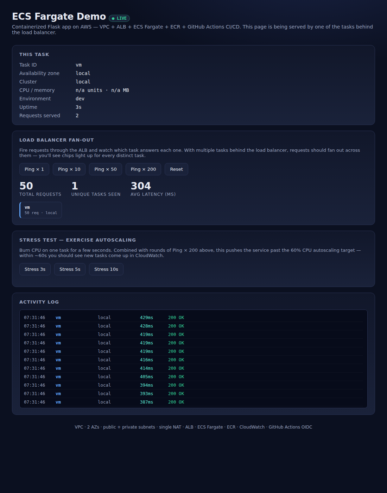
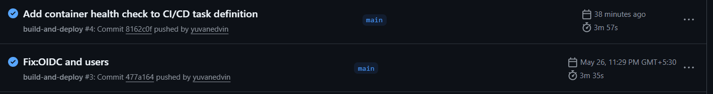
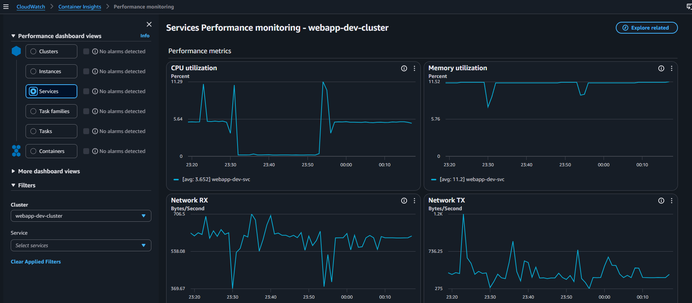

# Containerized Web App on AWS

A production-shaped reference deployment of a small Flask web application on
AWS, defined entirely in Terraform, containerized with Docker, fronted by an
Application Load Balancer, auto-scaled on ECS Fargate, deployed by GitHub
Actions, and monitored with CloudWatch.

> **Live URL:** `http://<your-alb-dns-name>.ap-south-2.elb.amazonaws.com/`
> _(grab from `terraform output alb_dns_name` after deploy)_



## Screenshots

<!-- Replace these placeholders after deploying. See "Adding screenshots" at
     the bottom of this README for how to commit and reference images. -->

### Interactive dashboard (served by ECS Fargate)


### CI/CD pipeline — GitHub Actions


### CloudWatch dashboard — ALB + ECS metrics

---

## Requirements coverage

| Requirement | Where it's met |
|---|---|
| Application containerized using Docker | Multi-stage `Dockerfile`, non-root user, Gunicorn — see [`app/`](app/) |
| Infrastructure defined using Terraform | Terraform 1.10+, AWS provider 5.x — see [`terraform/`](terraform/) |
| VPC with public/private subnets and security groups | 2 AZs, IGW, NAT, SG per tier — see `vpc.tf`, `security_groups.tf` |
| Load balancer in front of the application | Internet-facing ALB with `/health` target check — see `alb.tf` |
| Auto-scaling / multi-instance deployment | ECS Fargate service + Application Auto Scaling on CPU — see `ecs.tf` |
| CI/CD pipeline for automated deployments | GitHub Actions: build → push to ECR → update ECS — see [`.github/workflows/deploy.yml`](.github/workflows/deploy.yml) |
| Basic monitoring (logs / metrics) | CloudWatch logs, Container Insights, three alarms, dashboard — see `monitoring.tf` |

---

## Tech stack at a glance

- **Compute:** AWS ECS Fargate (serverless containers)
- **Network:** VPC with public/private subnets across 2 AZs, single NAT Gateway
- **Edge:** Application Load Balancer (HTTP)
- **Registry:** Amazon ECR with image scanning and lifecycle policy
- **State:** S3 backend with native S3 state locking (Terraform 1.10+)
- **IaC:** Terraform 1.10+ with AWS provider `~> 5.60`
- **CI/CD:** GitHub Actions assuming an AWS role via OIDC (no static keys)
- **Observability:** CloudWatch Logs, metric alarms, dashboard
- **Region:** `ap-south-2` (Hyderabad)

---

## Repository layout

```
.
├── app/                       Flask app + Dockerfile
│   ├── app.py
│   ├── Dockerfile
│   ├── requirements.txt
│   └── .dockerignore
│
├── terraform/                 All infrastructure code
│   ├── bootstrap/             One-time: S3 state bucket
│   │   ├── main.tf
│   │   ├── variables.tf
│   │   └── outputs.tf
│   ├── main.tf                Provider + S3 backend
│   ├── variables.tf
│   ├── locals.tf
│   ├── vpc.tf                 VPC, subnets, IGW, NAT, routes
│   ├── security_groups.tf     ALB SG + tasks SG
│   ├── alb.tf                 ALB, target group, listener
│   ├── ecr.tf                 Image registry
│   ├── iam.tf                 Execution + task roles
│   ├── ecs.tf                 Cluster, task def, service, autoscaling
│   ├── monitoring.tf          Log group, alarms, dashboard
│   └── outputs.tf
│
├── .github/
│   ├── workflows/deploy.yml   CI/CD pipeline
│   └── ecs/task-definition.json
│
├── docs/
│   ├── architecture.svg       Diagram (rendered above)
│   └── iam-setup.md           Local IAM user guidance
│
├── DEPLOYMENT.md              Full step-by-step deploy guide
└── README.md                  This file
```

---

## Quick start

Full step-by-step instructions live in [`DEPLOYMENT.md`](DEPLOYMENT.md). The
shape of it:

1. Configure AWS CLI with a dedicated IAM user (see [`docs/iam-setup.md`](docs/iam-setup.md))
2. `terraform -chdir=terraform/bootstrap apply -var='state_bucket_name=...'` — creates the S3 state bucket
3. `terraform -chdir=terraform init && terraform -chdir=terraform apply` — provisions all infrastructure (~45 resources)
4. Build and push the first Docker image to ECR
5. Force an ECS service deployment to pick it up
6. Wire up GitHub Actions (one-time OIDC role + repo secret), then push to `main`

---

## Architecture deep dive

### Network

A single VPC at `10.0.0.0/16` spanning two availability zones in
`ap-south-2`. Each AZ has:

- A **public subnet** (`/24`) — hosts the ALB and the NAT Gateway
- A **private subnet** (`/24`) — hosts the ECS tasks; no public IPs

Public subnets route `0.0.0.0/0` to the Internet Gateway; private subnets
route `0.0.0.0/0` to a single NAT Gateway (in AZ-a) so tasks can pull images
and ship logs without being reachable from the internet.

### Application layer

ECS Fargate runs the application as 2–6 tasks (autoscaled on CPU). Each task
is a Gunicorn server in a Docker container behind the ALB. Tasks register
themselves with the target group by ENI IP (`target_type = "ip"`), since
Fargate doesn't use EC2 instances.

The ALB health check hits `/health`. Tasks that fail the check are pulled
out of rotation; ECS replaces them.

### Security boundaries

Two security groups:

- **ALB SG** — accepts `:80` from `0.0.0.0/0`
- **Tasks SG** — accepts the container port **only from the ALB SG** (by
  security-group reference, not CIDR — the rule stays correct even as the
  ALB's IPs change)

IAM is split into two task roles by AWS convention:

- **Execution role** — used by the ECS agent to pull images from ECR and
  write to CloudWatch Logs
- **Task role** — used by the application itself; currently empty, but
  separated so you can grant the app least-privilege AWS API access (S3,
  SSM, etc.) without inflating the agent's permissions

A third IAM role (`github-deploy-webapp`) is assumed by GitHub Actions via
OIDC. No long-lived AWS access keys ever leave AWS.

### Deployment flow

```
git push origin main
      │
      ▼
GitHub Actions (OIDC → AWS)
      │
      ├──► ECR : docker build && docker push (tag = commit SHA)
      │
      └──► ECS : register new task definition,
                 update service with image tag,
                 wait for stability (rolling deploy, 50% min / 200% max)
```

Terraform owns the infrastructure shape. Deploys own the running image. The
service has `ignore_changes = [task_definition, desired_count]` so `terraform
apply` never fights the pipeline.

### Observability

- **Logs.** All container stdout/stderr lands in `/ecs/webapp-dev` with a
  14-day retention. Live tail with `aws logs tail /ecs/webapp-dev --follow`.
- **Metrics.** ECS Container Insights gives CPU/memory per task plus
  network and disk metrics.
- **Alarms.** Three CloudWatch alarms fire on the signals most likely to
  matter: ALB 5xx count, count of healthy targets behind the ALB, and
  sustained service-level CPU.
- **Dashboard.** One CloudWatch dashboard combines ALB request count, 5xx
  count, and ECS CPU/memory. Link is in `terraform output dashboard_url`.

---

## Design decisions

**ECS Fargate over an EC2 Auto Scaling Group.** The requirement is "auto-scaling
or multi-instance." Both work; Fargate removes node management (patching,
AMIs, cluster capacity providers) while still giving genuine horizontal
scaling at the task level. The right altitude for a small web app.

**Application Load Balancer over Network Load Balancer.** HTTP workload with
a managed health check on `/health` and the option of path-based routing
later. NLB would force lower-layer plumbing that buys nothing here.

**Two AZs.** Tasks land in both subnets, so a single-AZ outage doesn't take
the app down. ALB is multi-AZ by default.

**Public/private subnet split.** Standard pattern. ALB lives in public
subnets, tasks live in private subnets. Tasks have no public IPs and only
accept traffic from the ALB's security group. Outbound traffic goes through
NAT.

**Two IAM roles for tasks (execution + task).** Separation lets the
application get its own AWS API permissions later without inflating the
agent's role.

**Target-tracking autoscaling on CPU.** Simpler to reason about than step
scaling: set a target (60%), let AWS figure out the task count.

**Terraform `ignore_changes` on task definition and desired count.** Once
CI/CD owns deploys, Terraform shouldn't undo them on the next `apply`.
Infrastructure shape stays in Terraform; image rolls stay in the pipeline.

**OIDC for CI/CD.** GitHub Actions assumes an IAM role via OIDC instead of
using stored AWS access keys. Removes a whole class of secret-leak risk.

**S3 native state locking (`use_lockfile = true`).** Available since
Terraform 1.10, replaces the older S3+DynamoDB pattern. One fewer resource
to provision, no DynamoDB cost.

**Optimized Docker build.** Multi-stage Dockerfile with a separate builder
that compiles the venv, runtime stage on `python:3.12-slim`, non-root
user (uid 10001), BuildKit cache mount for `pip`, exec-form `CMD` for
clean SIGTERM handling, `gthread` Gunicorn workers using `/dev/shm` for
worker state. Final image size ~85 MB. Build details in
[`app/Dockerfile`](app/Dockerfile).

---

## Trade-offs considered

| Decision | Alternative | Why this choice |
|---|---|---|
| Fargate | EC2 + ECS Auto Scaling | No node ops; the per-vCPU-hour premium is small at this scale |
| Single NAT Gateway | One NAT per AZ | Saves ~$32/mo. Acceptable AZ-failure exposure for dev; flip to per-AZ for prod |
| ALB | API Gateway + Lambda | Container is a hard requirement; ALB is the natural fit |
| ECS | EKS (Kubernetes) | EKS adds a $73/mo control-plane fee plus significant ops surface for one workload |
| GitHub Actions | AWS CodePipeline + CodeBuild | Faster to wire up; CodePipeline is cleaner only if you're all-in on AWS |
| HTTP only | HTTPS via ACM | Out of scope for the assessment; one listener change to add (see hardening) |
| CloudWatch | Datadog / Prometheus + Grafana | No extra vendor; meets the "basic monitoring" bar |
| `latest` tag + force-deploy | Immutable tags + new task def every deploy | The pipeline actually does the immutable-tag pattern via `render-task-definition`; `latest` exists only for manual rollouts |
| Native S3 locking | S3 + DynamoDB | One fewer resource, no DynamoDB cost; legacy DynamoDB approach kept in a comment for ≤1.9 users |

---

## Cost awareness and optimization

Estimated monthly cost in `ap-south-2` at default sizing (2 × 0.25 vCPU /
0.5 GB tasks, modest traffic):

| Component | Approx. monthly (USD) |
|---|---|
| Fargate — 2 tasks × 0.25 vCPU × 0.5 GB, 730h | ~$9 |
| Application Load Balancer (base + minimal LCUs) | ~$17 |
| NAT Gateway (single) — hourly + data | ~$32 + traffic |
| CloudWatch Logs — 14-day retention, low volume | <$2 |
| ECR storage — ≤10 images via lifecycle policy | <$1 |
| S3 state bucket — versioned, tiny | <$1 |
| **Total** | **~$60/mo** |

### What's already optimized

- **Single NAT Gateway** instead of per-AZ — biggest single saving.
- **CloudWatch log retention capped at 14 days** via `log_retention_days`.
- **ECR lifecycle policy** expires all but the last 10 images.
- **Right-sized Fargate tasks** (256 CPU / 512 MB) — smallest viable unit;
  autoscaling adds capacity only above 60% CPU.
- **`deregistration_delay = 20s`** so old tasks don't linger (you pay for
  them while they drain).
- **S3 backend lifecycle rule** expires non-current state versions after
  90 days, capping state-bucket growth.
- **`enable_deletion_protection = false`** on the ALB so dev environments
  can be torn down cleanly with `terraform destroy`.

### What to do next to save more

- **VPC endpoints for ECR + CloudWatch Logs.** Removes most NAT data
  charges (image pulls and log shipping no longer traverse NAT). Pays for
  itself above modest traffic.
- **Fargate Spot** for non-prod workloads — ~70% cheaper, eviction-tolerant.
- **Compute Savings Plans** once steady-state usage is known.
- **CloudFront + S3** in front for any static assets, so the app never
  serves bytes a CDN could cache.

---

## Production hardening (deliberately omitted)

To keep the assessment in scope, these were skipped — and called out so
they aren't mistaken for oversights:

- **HTTPS listener on `:443`** with an ACM certificate + redirect from `:80`
- **AWS WAF** in front of the ALB for L7 protection
- **NAT Gateway per AZ** for true AZ-failure resilience
- **Secrets via SSM Parameter Store / Secrets Manager** wired into the task
  through the execution role
- **Blue/green deploys via CodeDeploy** instead of rolling
- **SNS topic + alarm actions** so alarms actually page someone (PagerDuty,
  email, Slack, …)
- **`force_delete = false` on ECR in prod** — currently `true` for clean
  dev teardown

Most of these are small additions to the existing modules.

---

## Adding screenshots to this README

Two ways, in order of cleanliness:

**Option A — commit images to the repo (recommended).**

1. Capture screenshots: the live dashboard, the green Actions run, the
   CloudWatch dashboard, the AWS console showing the ECS service.
2. Save them to `docs/screenshots/` with descriptive names:
   `dashboard.png`, `github-actions.png`, `cloudwatch.png`.
3. Commit and push:

   ```bash
   git add docs/screenshots/*.png
   git commit -m "Add deployment screenshots"
   git push
   ```

The image tags already in this README (``)
will resolve automatically once the files exist. Relative paths render
correctly both on GitHub and in local previews.

**Option B — drag-and-drop into a GitHub issue/PR.**

1. Open any draft issue or PR comment on the repo.
2. Drag an image file into the comment box. GitHub uploads it to
   `user-images.githubusercontent.com` and inserts a Markdown link.
3. Copy that markdown (e.g. ``)
   and paste it into the README in your editor.
4. Close the issue/PR without submitting.

Option B is faster for one-off images, but the links live on GitHub's CDN
forever — you don't own them. Option A keeps the assets in the repo where
they belong.

---

See [`DEPLOYMENT.md`](DEPLOYMENT.md#tear-down) for the full sequence,
including the versioned-bucket cleanup needed for the bootstrap module.

Short version:

```bash
terraform -chdir=terraform destroy
```

The bootstrap S3 bucket has `prevent_destroy = true` as a safety latch;
tearing it down requires removing that line and emptying object versions
first.
